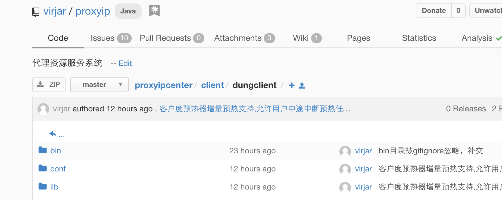

# 讲解如何build client的代码
- 获取已经编译好的稳定版本jar包
- 通过maven 将client安装到本地仓库(建议使用这种方式)
- 编译包含预热器的java脚本

### 获取已经编译好的稳定版本jar包
项目仍在开发中,暂时没有考虑在某个maven中央仓库发布,所以需要用户自己build代码.不过在client/dungclient 目录中存在一个编译好的client,包括他所依赖的jar包

无论通过何种方式,获取到代码,在发布文件目录可以找到jar包资源,同时这个目录包含了jar包所依赖的其他base lib。同时,这个文件夹也包含适用于离线预热IP资源的一个脚本。
dunclient 目录结构如下 
```
bogon:dungclient virjar$ tree
.
|____bin
| |____preHeater.bat
| |____preHeater.sh
|____conf
| |____logback.xml
| |____proxyclient.properties
|____lib
| |____async-http-client-1.9.39.jar
| |____commons-codec-1.9.jar
| |____commons-io-2.4.jar
| |____commons-lang3-3.4.jar
| |____commons-logging-1.2.jar
| |____dungproxy-client-0.0.1-SNAPSHOT.jar
| |____fastjson-1.1.31.jar
| |____guava-19.0.jar
| |____httpclient-4.4.1.jar
| |____httpcore-4.4.1.jar
| |____jcl-over-slf4j-1.7.12.jar
| |____jul-to-slf4j-1.7.12.jar
| |____log4j-over-slf4j-1.7.12.jar
| |____logback-classic-1.1.3.jar
| |____logback-core-1.1.3.jar
| |____maven-metadata-appassembler.xml
| |____netty-3.10.5.Final.jar
| |____netty-all-4.1.4.Final.jar
| |____slf4j-api-1.7.12.jar
bogon:dungclient virjar$ 
```

- bin目录是两个分别适用于windows和unix的预热器启动脚本,执行他将会启动离线预热任务
- conf目录是离线预热器的配置目录,用来配置预热任务的相关参数
- lib目录是离线预热器的相关jar包,包括dungproxyclient的jar和他所依赖的必要jar包

关于离线预热器的具体作用,和具体使用方法,参见:TODO

### 通过maven 将client安装到本地仓库(建议使用这种方式)
项目通过maven管理,编译打包jar包比较简单。如下步骤
1. clone代码 ``git clone https://git.oschina.net/virjar/proxyipcenter.git``

```
bogon:temp virjar$ ls
bogon:temp virjar$ git clone https://git.oschina.net/virjar/proxyipcenter.git
Cloning into 'proxyipcenter'...
remote: Counting objects: 4809, done.
remote: Compressing objects: 100% (3638/3638), done.
remote: Total 4809 (delta 2410), reused 990 (delta 530)
Receiving objects: 100% (4809/4809), 11.59 MiB | 1.37 MiB/s, done.
Resolving deltas: 100% (2410/2410), done.
Checking connectivity... done.
bogon:temp virjar$ ls
proxyipcenter
bogon:temp virjar$ cd proxyipcenter/
bogon:proxyipcenter virjar$ ls
README.md		ddl_version1.1.sql	pom.xml			repeater
client			doc			proxyipcenter-dotnet	server
bogon:proxyipcenter virjar$ 
```
2. install 到本地maven库 ``mvn install -Dmaven.test.skip=true``

```
bogon:proxyipcenter virjar$ mvn install -Dmaven.test.skip=true
[INFO] Scanning for projects...
[WARNING] 
[WARNING] Some problems were encountered while building the effective model for com.virjar:client:jar:0.0.1-SNAPSHOT
[WARNING] 'build.plugins.plugin.version' for org.apache.maven.plugins:maven-compiler-plugin is missing. @ line 17, column 21
[WARNING] 
[WARNING] It is highly recommended to fix these problems because they threaten the stability of your build.
[WARNING] 
[WARNING] For this reason, future Maven versions might no longer support building such malformed projects.
[WARNING] 
.....
[INFO] 
[INFO] dungproxy ......................................... SUCCESS [0.502s]
[INFO] client ............................................ SUCCESS [4.103s]
[INFO] proxyipcenter-sever ............................... SUCCESS [9.467s]
[INFO] repeater .......................................... SUCCESS [0.476s]
[INFO] ------------------------------------------------------------------------
[INFO] BUILD SUCCESS
[INFO] ------------------------------------------------------------------------
[INFO] Total time: 14.757s
[INFO] Finished at: Tue Nov 01 01:11:40 CST 2016
[INFO] Final Memory: 42M/368M
[INFO] ------------------------------------------------------------------------
bogon:proxyipcenter virjar$ 
```

### 编译包含预热器的java脚本
预热器的编译,仅仅是在maven的jar包外部做了保证,将配置文件、lib库提取到统一的地方,同时产生跨平台的脚本,用来管理各个配置文件,lib库的关系,并且提供启动预热器的入口。
预热器编译使用了maven插件,方式如下:
在`` client ``中执行命令 ``mvn clean package appassembler:assemble``
 ```
 bogon:client virjar$ mvn clean package appassembler:assemble -Dmaven.test.skip=true
 [INFO] Scanning for projects...
 [INFO]                                                                         
 [INFO] ------------------------------------------------------------------------
 [INFO] Building client 0.0.1-SNAPSHOT
 [INFO] ------------------------------------------------------------------------
 [INFO] 
 [INFO] --- maven-clean-plugin:2.4.1:clean (default-clean) @ dungproxy-client ---
 [INFO] Deleting /Users/virjar/git/proxyipcenter/client/target
 [INFO] 
 [INFO] --- maven-resources-plugin:2.5:resources (default-resources) @ dungproxy-client ---
 [debug] execute contextualize
 [INFO] Using 'UTF-8' encoding to copy filtered resources.
 [INFO] Copying 27 resources
 [INFO] 
 [INFO] --- maven-compiler-plugin:3.5.1:compile (default-compile) @ dungproxy-client ---
 [INFO] Changes detected - recompiling the module!
 [INFO] Compiling 78 source files to /Users/virjar/git/proxyipcenter/client/target/classes
 [INFO] /Users/virjar/git/proxyipcenter/client/src/main/java/com/virjar/dungproxy/client/httpclient/CrawlerHttpClient.java: 某些输入文件使用或覆盖了已过时的 API。
 [INFO] /Users/virjar/git/proxyipcenter/client/src/main/java/com/virjar/dungproxy/client/httpclient/CrawlerHttpClient.java: 有关详细信息, 请使用 -Xlint:deprecation 重新编译。
 [INFO] /Users/virjar/git/proxyipcenter/client/src/main/java/com/virjar/client/proxyclient/VirjarAsyncClient.java: 某些输入文件使用了未经检查或不安全的操作。
 [INFO] /Users/virjar/git/proxyipcenter/client/src/main/java/com/virjar/client/proxyclient/VirjarAsyncClient.java: 有关详细信息, 请使用 -Xlint:unchecked 重新编译。
 [INFO] 
 [INFO] --- maven-resources-plugin:2.5:testResources (default-testResources) @ dungproxy-client ---
 [debug] execute contextualize
 [INFO] Using 'UTF-8' encoding to copy filtered resources.
 [INFO] Copying 2 resources
 [INFO] 
 [INFO] --- maven-compiler-plugin:3.5.1:testCompile (default-testCompile) @ dungproxy-client ---
 [INFO] Not compiling test sources
 [INFO] 
 [INFO] --- maven-surefire-plugin:2.10:test (default-test) @ dungproxy-client ---
 [INFO] Tests are skipped.
 [INFO] 
 [INFO] --- maven-jar-plugin:2.3.2:jar (default-jar) @ dungproxy-client ---
 [INFO] Building jar: /Users/virjar/git/proxyipcenter/client/target/dungproxy-client-0.0.1-SNAPSHOT.jar
 [INFO] 
 [INFO] --- appassembler-maven-plugin:1.1.1:assemble (default-cli) @ dungproxy-client ---
 [INFO] Installing /Users/virjar/.m2/repository/org/slf4j/slf4j-api/1.7.12/slf4j-api-1.7.12.jar to /Users/virjar/git/proxyipcenter/client/target/dungclient/lib/slf4j-api-1.7.12.jar
 [INFO] Installing /Users/virjar/.m2/repository/io/netty/netty-all/4.1.4.Final/netty-all-4.1.4.Final.jar to /Users/virjar/git/proxyipcenter/client/target/dungclient/lib/netty-all-4.1.4.Final.jar
 [INFO] Installing /Users/virjar/.m2/repository/com/ning/async-http-client/1.9.39/async-http-client-1.9.39.jar to /Users/virjar/git/proxyipcenter/client/target/dungclient/lib/async-http-client-1.9.39.jar
 [INFO] Installing /Users/virjar/.m2/repository/io/netty/netty/3.10.5.Final/netty-3.10.5.Final.jar to /Users/virjar/git/proxyipcenter/client/target/dungclient/lib/netty-3.10.5.Final.jar
 [INFO] Installing /Users/virjar/.m2/repository/com/google/guava/guava/19.0/guava-19.0.jar to /Users/virjar/git/proxyipcenter/client/target/dungclient/lib/guava-19.0.jar
 [INFO] Installing /Users/virjar/.m2/repository/org/apache/commons/commons-lang3/3.4/commons-lang3-3.4.jar to /Users/virjar/git/proxyipcenter/client/target/dungclient/lib/commons-lang3-3.4.jar
 [INFO] Installing /Users/virjar/.m2/repository/org/apache/httpcomponents/httpclient/4.4.1/httpclient-4.4.1.jar to /Users/virjar/git/proxyipcenter/client/target/dungclient/lib/httpclient-4.4.1.jar
 [INFO] Installing /Users/virjar/.m2/repository/org/apache/httpcomponents/httpcore/4.4.1/httpcore-4.4.1.jar to /Users/virjar/git/proxyipcenter/client/target/dungclient/lib/httpcore-4.4.1.jar
 [INFO] Installing /Users/virjar/.m2/repository/commons-logging/commons-logging/1.2/commons-logging-1.2.jar to /Users/virjar/git/proxyipcenter/client/target/dungclient/lib/commons-logging-1.2.jar
 [INFO] Installing /Users/virjar/.m2/repository/commons-codec/commons-codec/1.9/commons-codec-1.9.jar to /Users/virjar/git/proxyipcenter/client/target/dungclient/lib/commons-codec-1.9.jar
 [INFO] Installing /Users/virjar/.m2/repository/com/alibaba/fastjson/1.1.31/fastjson-1.1.31.jar to /Users/virjar/git/proxyipcenter/client/target/dungclient/lib/fastjson-1.1.31.jar
 [INFO] Installing /Users/virjar/.m2/repository/commons-io/commons-io/2.4/commons-io-2.4.jar to /Users/virjar/git/proxyipcenter/client/target/dungclient/lib/commons-io-2.4.jar
 [INFO] Installing /Users/virjar/.m2/repository/ch/qos/logback/logback-classic/1.1.3/logback-classic-1.1.3.jar to /Users/virjar/git/proxyipcenter/client/target/dungclient/lib/logback-classic-1.1.3.jar
 [INFO] Installing /Users/virjar/.m2/repository/ch/qos/logback/logback-core/1.1.3/logback-core-1.1.3.jar to /Users/virjar/git/proxyipcenter/client/target/dungclient/lib/logback-core-1.1.3.jar
 [INFO] Installing /Users/virjar/.m2/repository/org/slf4j/jcl-over-slf4j/1.7.12/jcl-over-slf4j-1.7.12.jar to /Users/virjar/git/proxyipcenter/client/target/dungclient/lib/jcl-over-slf4j-1.7.12.jar
 [INFO] Installing /Users/virjar/.m2/repository/org/slf4j/jul-to-slf4j/1.7.12/jul-to-slf4j-1.7.12.jar to /Users/virjar/git/proxyipcenter/client/target/dungclient/lib/jul-to-slf4j-1.7.12.jar
 [INFO] Installing /Users/virjar/.m2/repository/org/slf4j/log4j-over-slf4j/1.7.12/log4j-over-slf4j-1.7.12.jar to /Users/virjar/git/proxyipcenter/client/target/dungclient/lib/log4j-over-slf4j-1.7.12.jar
 [INFO] Installing /Users/virjar/git/proxyipcenter/client/target/dungproxy-client-0.0.1-SNAPSHOT.jar to /Users/virjar/git/proxyipcenter/client/target/dungclient/lib/dungproxy-client-0.0.1-SNAPSHOT.jar
 [INFO] ------------------------------------------------------------------------
 [INFO] BUILD SUCCESS
 [INFO] ------------------------------------------------------------------------
 [INFO] Total time: 5.090s
 [INFO] Finished at: Sat Dec 17 23:04:55 CST 2016
 [INFO] Final Memory: 19M/226M
 [INFO] ------------------------------------------------------------------------
 bogon:client virjar$ 
 ```
 编译好在target目录将会产生一个dunclient的目录,这个目录这是可以执行离线预热任务的脚本目录
 ```
 bogon:client virjar$ cd target/
 bogon:target virjar$ ls
 classes					dungproxy-client-0.0.1-SNAPSHOT.jar	maven-archiver				test-classes
 dungclient				generated-sources			maven-status
 bogon:target virjar$ cd dungclient/
 bogon:dungclient virjar$ ls -al
 total 0
 drwxr-xr-x   5 virjar  staff  170 12 17 23:04 .
 drwxr-xr-x   9 virjar  staff  306 12 17 23:04 ..
 drwxr-xr-x   4 virjar  staff  136 12 17 23:04 bin
 drwxr-xr-x   4 virjar  staff  136 12 17 23:04 conf
 drwxr-xr-x  21 virjar  staff  714 12 17 23:04 lib
 bogon:dungclient virjar$ 
 ```