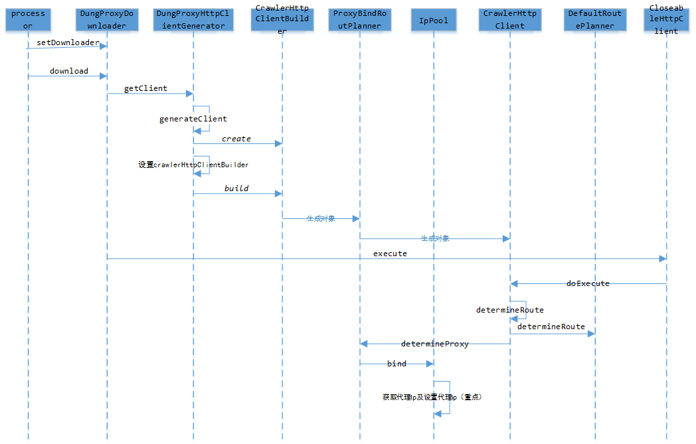

#DungProxyDownloader

dungProxyDownloader默认使用CrawlerHttpClient,CrawlerHttpClient是对httpClient的一个扩展,他完全兼容普通httpClient的使用方法,除此之外还实现了很多对爬虫有用的默认策略。其中最主要的两个特性就是多用户cookie隔离和代理IP池。
dungProxyDownloader可以作为普通httpclient使用,这个时候IP池是已经注册了的(dungProxy的IP池,非webMagic原生IP池)。但是对于多用户的支持,因为webmagic并没有提供扩展入口,所以dungProxyDownloader有一部分代码在处理多用户session维护问题。不过无论如何,他都和原生保持兼容。

webmagic到DungProxyDownloader然后到IP池的时序图如下:(感谢寻找上帝之道提供)

