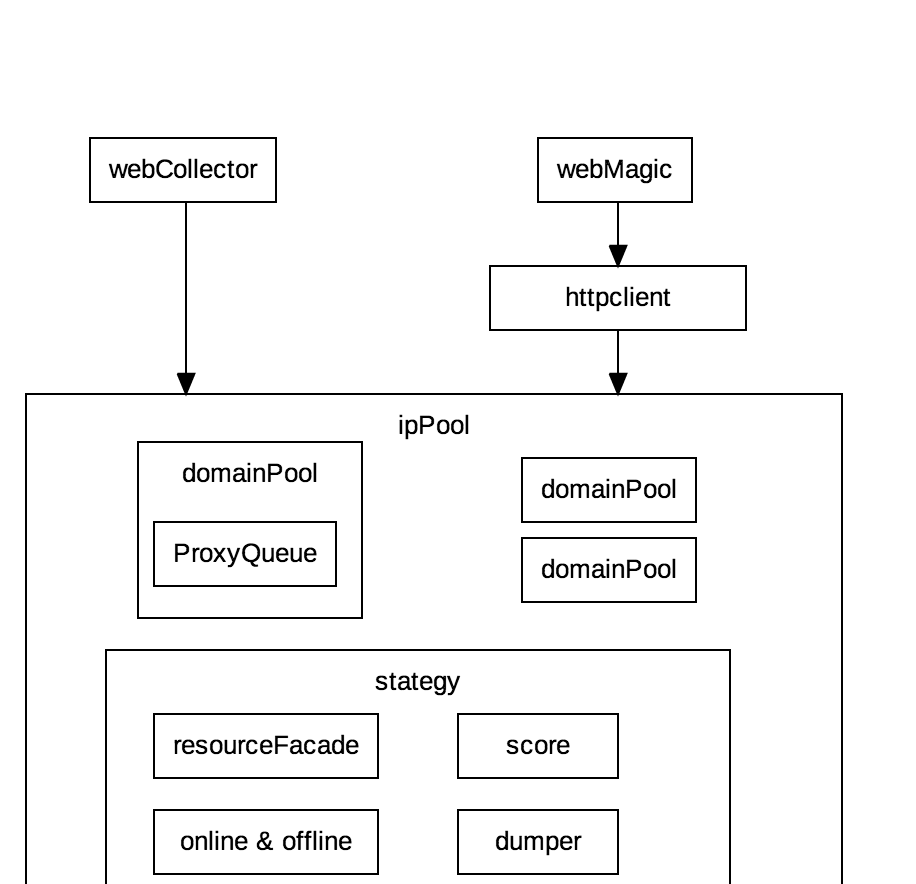

#client运行原理
这里讲述IP池的设计相关,如果您仅仅是为了使用dunproxy-client,则不必关心本文内容

client就是一个代理IP池的实现,IP池的设计基于两个点 1)代理IP都是不稳定的,不可靠的,需要一个机制来切换IP,尽可能使用高质量IP。2)IP和环境关系很大,同一个IP在不同的机器下访问不同的目标网站,其可用性表现都是不一样的

下面讲述client如何通过某种策略规避上面两个问题。

client结果如下图:

## client三个组成模块
client定位与代理IP池,所以主要也是干这个的。但是考虑到我们自己要决定什么时候使用代理,什么时候销毁他,还有和我们自己的网络访问层集成。所以我们有做了一个模块,就是把这个代理IP池集成到httpclient(需要的httpclient版本是4.4+,选择这个版本是拍脑门儿选择的,没有原因,如果有问题可以尝试降低版本)里面。再然后,发现使用httpclient请求一次数据实在麻烦,按照httpclient原生方式发送一个get请求不知道要写多少代码,所以顺便又在httpclient上面做了一个封装,提供了常见场景下的请求包装。
### IpPool IP池的核心
IpPool是单例的,做成单例的原因是,没有地方存放这个实例。我希望多个httpclient能够共用同一份IpPool,但是有不想侵入到httpclient里面。所以就单例了。想想貌似也不会太恶心吧。
#### IpPool 数据模型
分为两层,算起来就是一个multiMap结构,外层是一个总容器,根据domain放置了各自的domainPool,domainPool里面是一个IP资源集合,存放这个domain下面的可用IP。domainPool里面的IP不是list,是一个TreeMap,通过他实现了一个一致性hash结构,使IP绑定支持一致性hash的方式。
#### 资源引入接口 ``com.virjar.ipproxy.ippool.strategy.resource.ResourceFacade``
可以自己定义IP导入方式,系统一个默认实现``com.virjar.dungproxy.client.ippool.strategy.DefaultResourceFacade``,默认通过DungProxy的server请求数据。这个处理器要完成两个任务,下载IP资源,对IP资源进行使用反馈。
#### 判定哪些请求需要被代理 ``com.virjar.ipproxy.ippool.strategy.proxydomain.ProxyDomainStrategy``
默认有两个实现,黑名单方式和白名单方式。默认使白名单方式,只有再白名单中的host才会被代理,相反黑名单方式除了黑名单之中的host都会被代理(有意思的是如果你代理IP资源引入请求,会有死递归的问题)
#### 序列化和反序列化 ``com.virjar.ipproxy.ippool.strategy.serialization.AvProxyDumper``
本地IP池的资源是可贵的,对于某些网站可能需要运行很久才能使得这个IP池资源比较有效。因为本地IP池会随时刷新资源,下线资源。只有有效资源才能再一次一次的下线事件中保留下来。所以他是最契合本地环境的一批资源,特别是系统运行时间越长。所以我们会通过这个接口定时的将IP池dump出来,然后序列化。再下次系统启动的时候,优先反序列化这个数据。本来我是没有设置这个功能的,主要是我在本地调试的时候频繁起停程序,每次都需要很长时间才能够使得IPPool有效(有些网站特炒蛋)
#### 判定资源何时下线 ``com.virjar.ipproxy.ippool.strategy.offline.Offline``
如果一个IP反馈说失败了,那么将会这个接口判定是否需要下线这个IP。当然你也可以获取到代理IP的实例,手动控制下线
#### 规则加载
我们也遵循可配置即可编程的原则,虽然我们默认提供了一个配置文件的方式控制各种策略,但是你完全可以不来这一套。可以通过``com.virjar.dungproxy.client.ippool.config.Context.ConfigBuilder``来实现代码定制规则。当前我们系统也是通过他来实现properties文件的规则加载的。获取Builder实例之后,可以通过代码对他定制,然后使用``com.virjar.ipproxy.ippool.config.Context.initEnv``注册配置。不好意思,这个Context也是静态的,就当我再一次拍脑门儿了吧。
