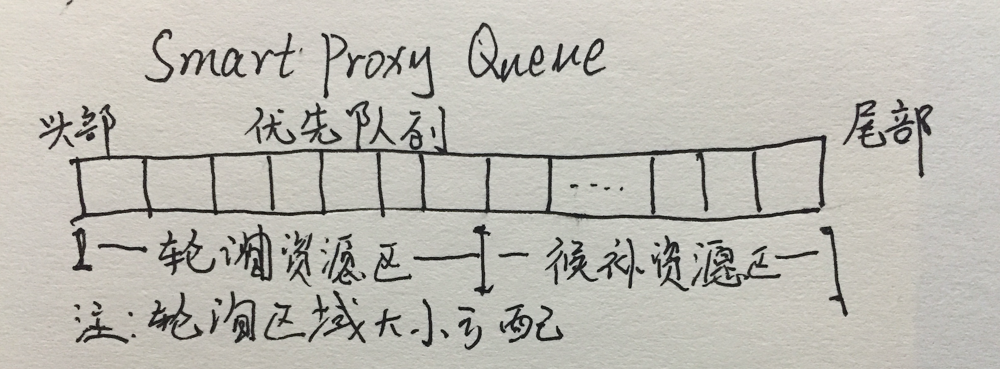
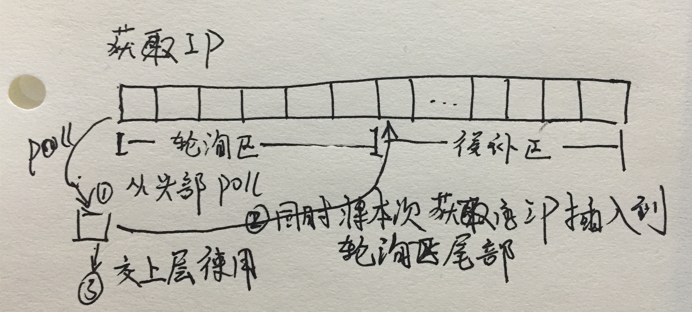
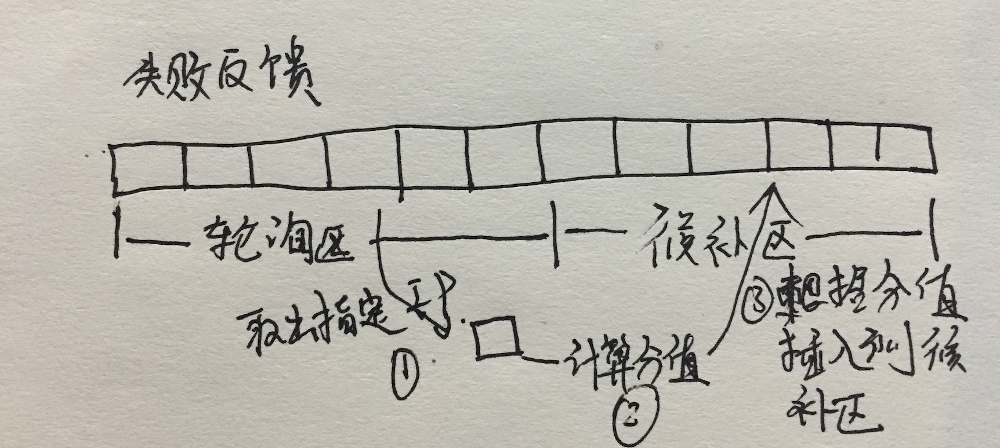

## IP容器模型:smartProxyQueue IP池的核心模型和算法,体现和普通IP池的差异的核心竞争力😄
smartProxyQueue是一个链表,用来实现IP轮训切换的队列,但是和一般的队列不同,他不是完全符合先进先出的规则的,而是一个高质量IP轮训,低质量候补的队列。这样,保证IP可以切换使用,且每次切换的IP都是较高质量的。
smartProxyQueue的结构如下:

队列分为轮询区域,候补区。他是在LinkedList上面的一个逻辑区域划分,使用一个ratio参数控制。轮询区域的资源没有分值优先级概念,每次使用IP从轮询区头部获取一个IP,并将其插入到轮询区的尾部。如果这些IP始终都没有失败,那么很完美,容器只会使用轮询区的IP。

获取一个IP的时候,流程如下

轮询区域的资源没有分值优先级概念,每次使用IP从轮询区头部获取一个IP,并将其插入到轮询区的尾部。

如果绑定的IP没有失败,则不进行队列位置调整

如果IP存在失败,那么进去失败候补流程,如下图:

不论此时IP在轮询区那个位置,都把他取出来,然后计算当前分值,根据分值插入到候补区的某个位置,候补区这是一个优先级区域了,分值高的资源将会存在候补区头部,约低越往后。
插入位置计算算法:
```
int index = (int) (proxies.size() * (ratio + (1 - ratio) * (1 - avProxy.getScore().getAvgScore())));
proxies.add(index, avProxy);
```
其中IP分值是一个0-1的小数。0表示分值最低,1表示分值最高。
所以如果分数为0,那么将会插入到候补区到尾部;如果分数为1,那么将会插入到候补区尾部


## smartProxyQueue和普通队列的比较
可以明确的是,普通队列不能根据IP质量来调整IP使用的概率,如果一个IP一直不可用,普通队列方式可以快速触发他下线,因为每使用一次他就会失败一次,从而导致打分降低快速降低。这个时候因为smartProxyQueue调度低质量IP的概率小,这个低质量IP存在于IP池的时间也就更长了。
但是如果一个IP偶尔失败,但不是全部失败,那么普通队列里面,都是以相等的概率调度IP资源。没有做到高质量IP高调度概率。但是因为IP可用(没有达到下线临界值),所以IP一直在使用。这个场景就可以对比出普通队列smartProxyQueue的差别了。
假定有一批IP资源都是可用的,但是他们的质量有差别,也即同时存在质量好的IP和质量不太好的IP。普通队列对他的调度方式是公平的,高质量IP和低质量IP使用概率相同。但是对于smartProxyQueue来说,他的调度则不是公平的,因为失败将会导致队列顺序惩罚。惩罚之后距离下次被调度的可能性就会低一些。且惩罚力度是根据本IP连续一段时间的使用情况的打分而定的,所以失败率越大的IP惩罚力度越大、被调度的概率越小。


## 设计smartProxyQueue的原因
在考虑代理IP是容器的数据结构的时候,我也有调研过其他IP池的设计方案,包括某公司、webMagic、我师傅。我发现这些解决方案出奇的一致,那就是在时间上面做惩罚。我觉得想到这个点也很自然,失败了嘛,失败了就禁用一段时间。让他消停一会儿再试。然后另一个原因就是IP池嘛,他和普通资源池不一样的是她需要进行沦陷(不像连接池之类的那个空闲用那个),轮询就是队列这种数据结构的经典用法,然后看java里面的队列,要支持线程安全,要支持优先级特性(调整不同IP的使用优先级)。
这个时候找到的就是ConcurrentLinkedQueue,DelayQueue之类的。

但是时间惩罚真的能够满足需要吗,maybe是不能的,因为时间惩罚是不灵敏的。时间惩罚一般是分钟级别的惩罚,某公司是4分钟,webMagic是20分钟。但是代理IP可能这次可用下次不可用,考虑代理IP压力问题,代理IP单次转发链路选择问题,本身请求就不合法导致失败,正常的网络抖动。所以请求失败是太正常的事情了,不可能说失败一次就来一个分钟级别的禁用。
这个基本每个IP都在时间惩罚,导致大量IP因为被惩罚而不能服务,但是IP池可用IP被跑光的问题发生。所以时间惩罚用在高质量IP上面还能有点效果,但是那些会经常失败的IP上面就hold不住了。

所以这个问题可以往上一层抽象一下,我们做惩罚的目的是啥,是调整IP使用优先级。对于优先级的调整,不光可以在时间上面惩罚,在队列轮询顺序上面也可以啊。所以smartProxyQueue以顺序惩罚为主,他的灵命度比时间惩罚好很多,而且对环境的适应能力也强很多。

不过有一点倒是共通的,我们都需要根据使用历史来叠加惩罚力度,这个思想有点像以太网数据传输的冲突检测,还有tcp窗口控制的慢启动算法,还可以借鉴cpu调度那个反馈调度模型。
