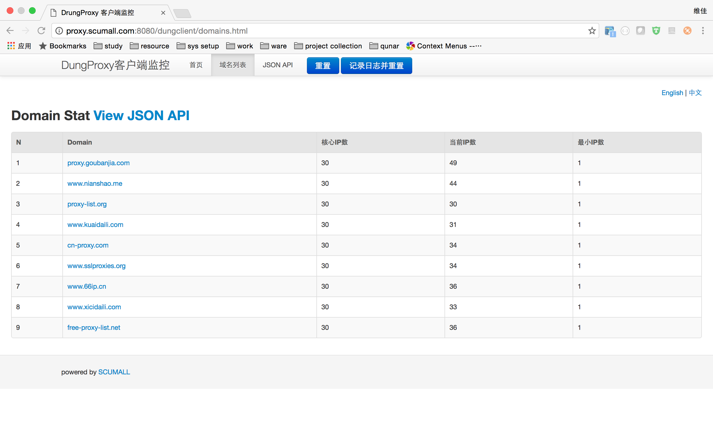

#代理池状态监控

代理池状态监控提供一个可视化界面,使得用户可以方便观察当前IP池各个域名下各个IP的使用情况,本模块当前正在开发,后续可能有些变动。

### 监控基础支撑

客户端提供监控界面,但是客户端不是server,所以他必须基于某个环境,参考durid,我使用了servlet。也就是说,客户端监控需要在tomcat之类的servlet容器中才能实现。

### 配置servlet入口
在web环境下,配置dungClient的servlet实现,
```
 <servlet>
        <servlet-name>DrungStatView</servlet-name>
        <servlet-class>com.virjar.dungproxy.client.ippool.support.http.StatViewServlet</servlet-class>
</servlet>
<servlet-mapping>
        <servlet-name>DrungStatView</servlet-name>
        <url-pattern>/dungclient/*</url-pattern>
</servlet-mapping>
    
```
dungProxy-server本身使用了client,也配置了该入口,参见代码[dungServer的web.xml](http://git.oschina.net/virjar/proxyipcenter/blob/master/server/src/main/webapp/WEB-INF/web.xml)

### 在浏览器上面访问该servlet首页


这个功能还在完善,计划提供在线配置代理池的功能