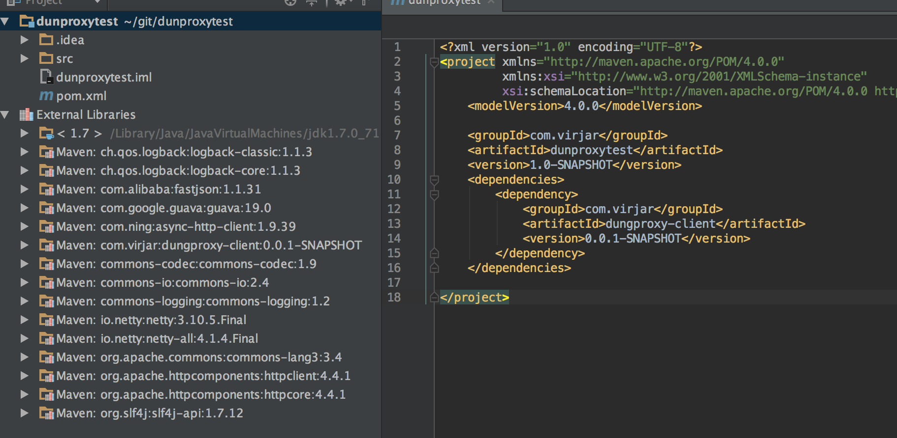
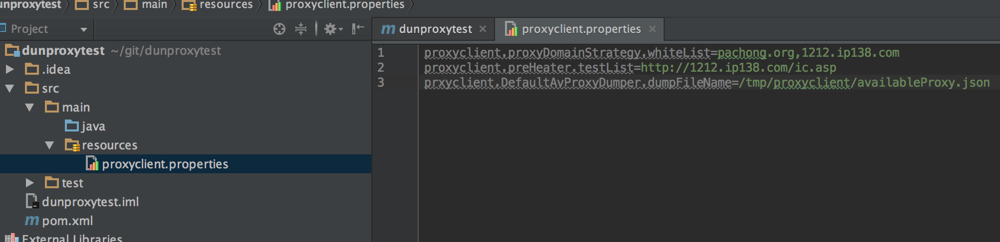

# 在java工程里面使用dungclient
##在普通java工程里面引入dungclient
dungclient所有jar包在client/dungclient/lib,拷贝所有jar包到你的lib下,并将其添加到classpath即可
##通过maven的方式引入dungclient
1. 首先需要安装依赖到本地maven库,参见[构建客户端代码](build_code.md)
2. 在自己的pom里面添加依赖

## 配置client规则
配置参数是使用配置文件描述一些代理池需要的规则。如确定那些请求需要被代理等。在resources目录添加文件``proxyclient.properties``


完整的配置如下:
```
#调研,可配置既可编程
#资源适配器,实现接口com.virjar.dungproxy.client.ippool.strategy.ResourceFacade,可以自定义,然后接入自己的ip源
proxyclient.resouce.resourceFacade=com.virjar.dungproxy.client.ippool.strategy.impl.DefaultResourceFacade
#代理策略配置
#WHITE_LIST,BLACK_LIST,所有请求都要代理,所有请求都不代理,在白名单的请求代理,不在黑名单的请求代理,可以自己实现自己的策略,
proxyclient.proxyDomainStrategy=WHITE_LIST
#配置需要代理的域名,当代理策略为黑名单策略的时候生效
proxyclient.proxyDomainStrategy.backList=115.159.40.202
#配置需要代理的域名,当代理策略为白名单策略的时候生效
proxyclient.proxyDomainStrategy.whiteList=pachong.org,cn-proxy.com,www.sslproxies.org,www.66ip.cn,proxy-list.org,free-proxy-list.net
#两分钟一次向服务器反馈IP使用情况
proxyclient.feedback.duration=120000
#序列化和反序列化接口,可以通过他导出自己需要的数据到想要的地方,可以将ip快照保持在某个地方,如放到文件,数据库等等
proxyclient.serialize.serializer=com.virjar.dungproxy.client.ippool.strategy.impl.JSONFileAvProxyDumper
#和JSONFileAvProxyDumper配合,将会把这个配置传递到序列化器。如果自定义实现不需要这个配置,那么也可以不配置他
proxyclient.DefaultAvProxyDumper.dumpFileName=/Users/virjar/git/proxyipcenter/client/product/availableProxy.json
#server统一代理服务,在本地IP池IP不足量的时候,尝试使用统一的中心服务器,他会进行转发代理。目前本模块没有经过充足测试,可以不用配置
proxyclient.defaultProxyList=115.159.40.202:8081
#对于预热器的一个配置,规定预热器检查的URL列表,逗号分割(如果有多个URL需要检测)
proxyclient.preHeater.testList=https://www.douban.com/group/explore
#默认中心服务器地址,如果IP下载器是默认实现(com.virjar.dungproxy.client.ippool.strategy.impl.DefaultResourceFacade),那么他会使用这个地址。否则本配置无效
proxyclient.resource.defaultResourceServerAddress=http://proxy.scumall.com:8080
#预热器增量序列化,在测试通过一定数目的资源的时候,就会将数据序列化,防止长时间运行,任务中断预热数据丢失
proxyclient.preHeater.serialize.step=30
#IP使用间隔,单位是毫秒,有些场景,IP有明确的控制说QPS,可以考虑使用这个参数来控制。如一分钟访问不能超过20次,那么 (60 * 1000 / 20) ,可以配置proxyclient.proxyUseIntervalMillis=3000
proxyclient.proxyUseIntervalMillis=0
#客户端ID,配置此参数拥有相同ID配置的所有节点的IP资源不重复
proxyclient.clientID=com.virjar.webcrawler
#代理规则路由,多个域名可以使用同一个代理规则,domain:similarDomain1,similarDomain2;domain2:similarDomain3,similarDomain4...
proxyclient.proxyDomainStrategy.group=www.dytt8.net:www.ygdy8.net
```

## 最简配置如下
```
proxyclient.proxyDomainStrategy.whiteList=pachong.org,cn-proxy.com,www.sslproxies.org,www.66ip.cn,proxy-list.org,free-proxy-list.net
proxyclient.DefaultAvProxyDumper.dumpFileName=/Users/virjar/git/proxyipcenter/client/product/availableProxy.json
```
需要注意,proxyclient.DefaultAvProxyDumper.dumpFileName最好是预热器预热结果的那个文件。这样IP池才能使用到预热结果

请注意⚠:最简配置里面的两个参数必须配置,且域名信息必须和预热器里面填写的testURL域名一致。dumpFile必须指向正确的预热结果文件。否则在启动程序的开始一段时间,是不会挂上代理的